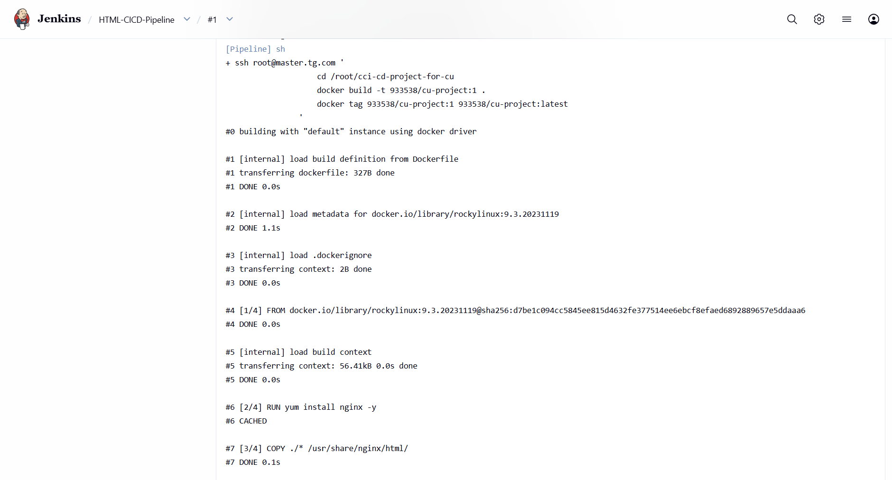
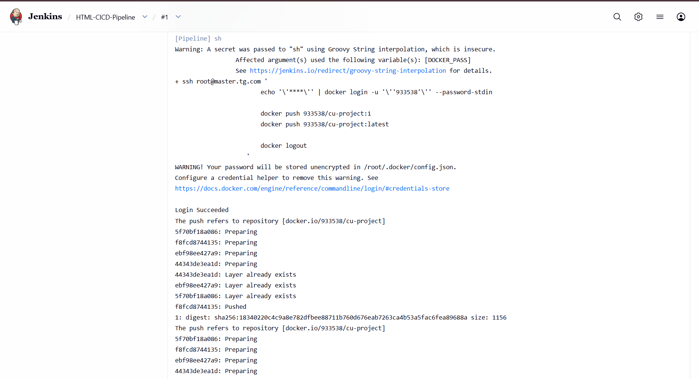
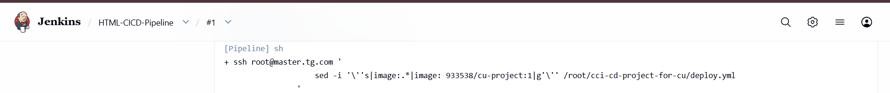
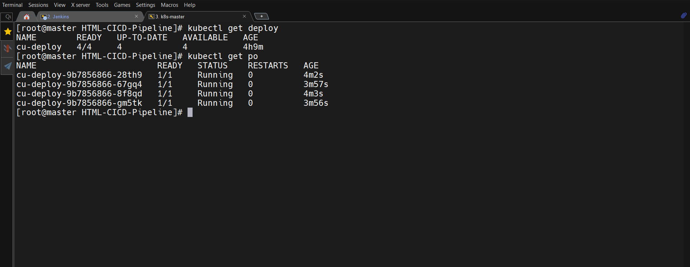
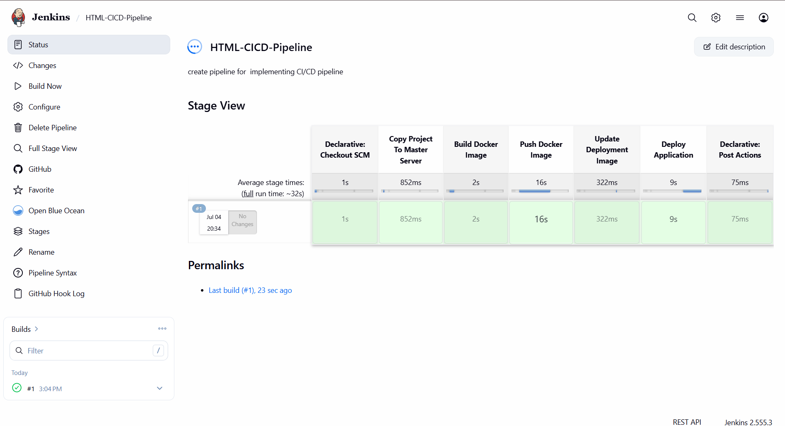
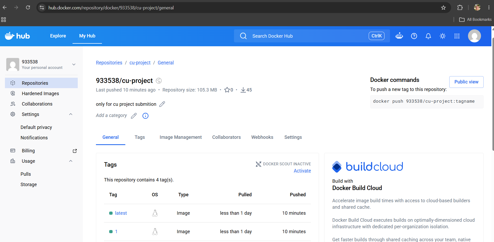
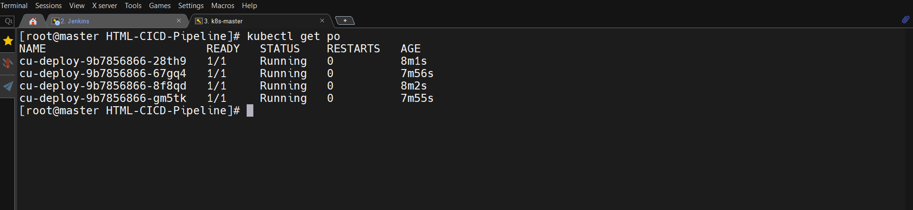
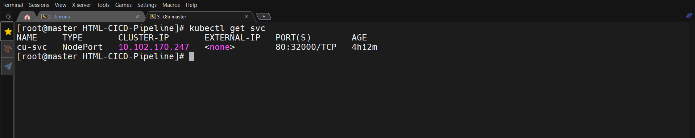
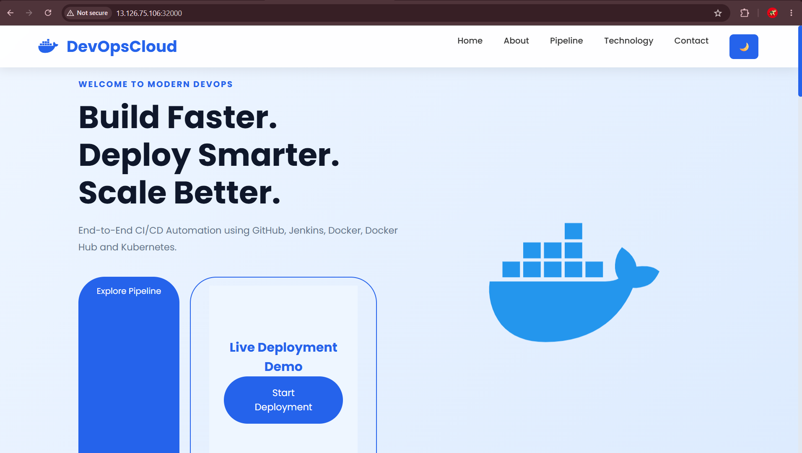

🚀 Implementing an End-to-End CI/CD Pipeline using Jenkins, Docker, Docker Hub & Kubernetes

📌 Project Overview

This project demonstrates the implementation of a complete **CI/CD (Continuous Integration and Continuous Deployment) Pipeline** for a static web application using **Jenkins, Docker, Docker Hub, and Kubernetes**.

The pipeline automates the entire deployment process—from code commit to application deployment. Whenever changes are pushed to the GitHub repository, Jenkins is automatically triggered through a GitHub Webhook. Jenkins then builds a Docker image, pushes it to Docker Hub, updates the Kubernetes deployment manifest, and deploys the latest version of the application to the Kubernetes cluster.

This project showcases a real-world DevOps workflow by integrating multiple tools to achieve automated, consistent, and reliable software delivery.

---

🎯 Project Objectives

- Implement an End-to-End CI/CD Pipeline
- Automate Build and Deployment Process
- Integrate GitHub with Jenkins using Webhooks
- Build Docker Images Automatically
- Push Docker Images to Docker Hub
- Deploy the Application on Kubernetes
- Reduce Manual Deployment Effort
- Understand Industry Standard DevOps Workflow

---

🛠️ Technology Stack

| Technology | Purpose |
|------------|---------|
| Git | Version Control |
| GitHub | Source Code Repository |
| Jenkins | CI/CD Automation |
| Docker | Containerization |
| Docker Hub | Docker Image Registry |
| Kubernetes | Container Orchestration |
| HTML, CSS & JavaScript | Static Web Application |
| Linux | Server Operating System |
| SSH | Remote Server Communication |

---

🏗️ Project Architecture

```text
                     Developer
                         │
                    Git Push
                         │
                         ▼
                GitHub Repository
                         │
                  GitHub Webhook
                         │
                         ▼
                    Jenkins Server
                         │
          ┌──────────────┴──────────────┐
          │                             │
          ▼                             ▼
 Build Docker Image             Update Deployment
          │                             │
          ▼                             │
     Push Image to Docker Hub           │
          │                             │
          └──────────────┬──────────────┘
                         ▼
                Kubernetes Master
                         │
                  kubectl apply
                         │
                         ▼
              Kubernetes Worker Node
                         │
                         ▼
             Static Web Application
```

---

🔄 CI/CD Workflow

1. Developer pushes the latest source code to GitHub.
2. GitHub Webhook automatically triggers the Jenkins Pipeline.
3. Jenkins checks out the latest source code.
4. Docker builds a new application image.
5. The image is pushed to Docker Hub.
6. Jenkins updates the Kubernetes deployment manifest.
7. Kubernetes pulls the latest Docker image.
8. The application is deployed automatically.
9. Jenkins verifies the deployment status.

---

📂 Project Structure

```text
HTML-CICD-Pipeline/
│
├── Dockerfile
├── Jenkinsfile
├── deploy.yml
├── svc.yml
├── index.html
├── style.css
├── script.js
├── README.md
└── images/
```

---

📸 Project Screenshots

The following screenshots should be included for better understanding of the project.

| Screenshot | Description |
|------------|-------------|
| 01 | GitHub Repository |
| 02 | GitHub Webhook Configuration |
| 03 | Jenkins Dashboard |
| 04 | Successful Pipeline Execution |
| 05 | Docker Hub Repository |
| 06 | Kubernetes Nodes |
| 07 | Running Pods |
| 08 | Deployment |
| 09 | Services |
| 10 | Application Running in Browser |

> **Note:** Create an `images` folder in the repository and place all screenshots there.

---

⚙️ Jenkins Pipeline Stages

The Jenkins pipeline consists of the following stages:

1. Checkout Source Code
- Pulls the latest source code from the GitHub repository.

### Jenkins Checkout


---

2. Build Docker Image
- Builds a Docker image using the project's Dockerfile.
- Tags the image with the current Jenkins build number and `latest`.

Example:

```text
933538/cu-project:15
933538/cu-project:latest
```



---

3. Push Docker Image
- Logs in to Docker Hub using Jenkins Credentials.
- Pushes both the versioned image and the latest image to Docker Hub.



---

4. Update Kubernetes Deployment
- Updates the deployment manifest with the newly created Docker image.

Example:

```yaml
image: 933538/cu-project:15
```



---

5. Deploy Application
- Applies the Deployment and Service manifests.
- Kubernetes automatically pulls the latest image from Docker Hub.
- Performs a Rolling Update without downtime.



---

☸ Kubernetes Deployment

The application is deployed on a Kubernetes cluster consisting of:

- **1 Master Node**
- **1 Worker Node**

Kubernetes Resources Used

| Resource | Purpose |
|----------|---------|
| Namespace | Isolates project resources |
| Deployment | Manages application Pods |
| ReplicaSet | Maintains desired number of Pods |
| Pod | Runs the application container |
| Service (NodePort) | Exposes the application externally |

---

🐳 Docker Image

The Docker image is built from the project source code using the provided `Dockerfile`.

Image Naming Convention:

```text
933538/cu-project:<BUILD_NUMBER>
```

Example:

```text
933538/cu-project:18
```

Latest Tag:

```text
933538/cu-project:latest
```

---

🚀 Deployment Workflow

```text
GitHub Push
      │
      ▼
GitHub Webhook
      │
      ▼
Jenkins Pipeline
      │
      ▼
Build Docker Image
      │
      ▼
Push Image to Docker Hub
      │
      ▼
Update Kubernetes Deployment
      │
      ▼
kubectl apply
      │
      ▼
Application Running
```

---

📷 Project Output

After a successful pipeline execution, the following should be verified:

Jenkins Pipeline

- Pipeline completed successfully
- All stages executed without errors



---

Docker Hub

- Latest Docker image available
- Versioned image available



---

Kubernetes Pods

```bash
kubectl get pods -n anu
```



---

Kubernetes Deployment

```bash
kubectl get deployment -n anu
```


---

Kubernetes Service

```bash
kubectl get svc -n anu
```



---

Application

Access the application using:

```text
http://<NodeIP>:<NodePort>
```



---

✨ Key Features

- End-to-End CI/CD Pipeline
- Automated Build & Deployment
- GitHub Webhook Integration
- Docker Image Versioning
- Docker Hub Integration
- Kubernetes Deployment
- Rolling Update Support
- SSH-based Automation
- Zero Manual Deployment
- Easy to Extend and Maintain

---

📚 Key Learnings

This project helped me gain hands-on experience with:

- Git & GitHub
- GitHub Webhooks
- Jenkins Pipeline
- Docker Image Creation
- Docker Hub Integration
- Kubernetes Deployments
- Rolling Updates
- Linux Administration
- SSH-based Automation
- CI/CD Best Practices

---

🚧 Challenges Faced

During the implementation of this project, I encountered several real-world challenges, including:

- Configuring GitHub Webhooks with Jenkins
- Managing SSH authentication between Jenkins and Kubernetes Master
- Resolving Docker Hub authentication issues
- Updating Kubernetes deployments with the latest image
- Handling Jenkins Pipeline syntax errors
- Debugging deployment failures and connectivity issues

These challenges provided valuable practical experience in troubleshooting and implementing CI/CD pipelines.

---`

🔮 Future Enhancements

The project can be extended by integrating additional DevOps tools such as:

- SonarQube for Code Quality Analysis
- Trivy for Docker Image Security Scanning
- Prometheus for Monitoring
- Grafana for Visualization
- Helm Charts for Kubernetes Package Management
- Argo CD for GitOps-based Continuous Delivery
- Kubernetes Ingress with SSL/TLS
- Canary and Blue-Green Deployment Strategies

---

📝 Prerequisites

Before running this project, ensure the following components are available:

- Git
- GitHub Account
- Jenkins Server
- Docker
- Docker Hub Account
- Kubernetes Cluster
- Linux Environment
- SSH Access Between Jenkins and Kubernetes Master

---

🚀 How to Run

1. Clone the repository.

```bash
git clone https://github.com/Anurag842321/HTML-CICD-Pipeline.git
```

2. Configure Jenkins Pipeline.

3. Configure GitHub Webhook.

4. Add GitHub and Docker Hub credentials in Jenkins.

5. Push changes to the GitHub repository.

6. Jenkins will automatically:

- Pull the latest code
- Build the Docker image
- Push the image to Docker Hub
- Update Kubernetes deployment
- Deploy the latest version of the application

---

📊 Project Outcome

This project successfully demonstrates an automated CI/CD workflow for deploying a static web application.

The implementation reduces manual effort, improves deployment consistency, and enables faster software delivery by integrating GitHub, Jenkins, Docker, Docker Hub, and Kubernetes into a single automated pipeline.

---

👨‍💻 Author

**Anurag Mishra**

**MCA Graduate**
Skills

- DevOps
- Linux
- Docker
- Kubernetes
- Jenkins
- Git & GitHub
- Cloud Computing

---

🤝 Contributing

Contributions, suggestions, and improvements are welcome.

If you would like to improve this project, feel free to fork the repository and submit a Pull Request.

---

⭐ Support

If you found this project useful, consider giving it a ⭐ on GitHub.

It helps others discover the project and motivates further improvements.

---

📄 License

This project is created for educational and learning purposes.

Feel free to use or modify it for personal or academic projects.

